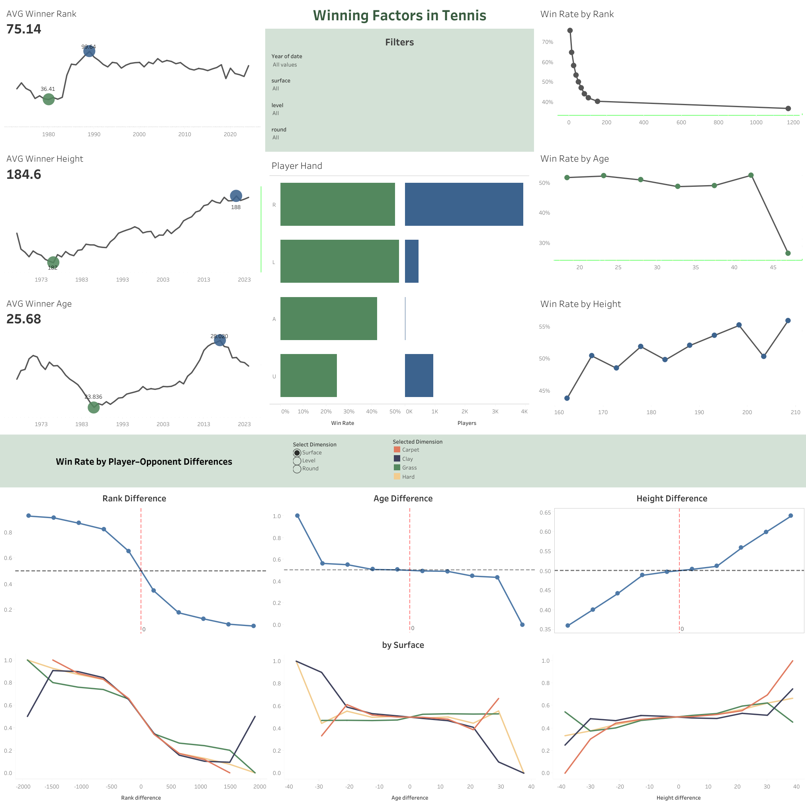

# Analysis of Winning Factors in Tennis | python & Tableau

Link to Tableau: [Winning Factors in Tennis](https://public.tableau.com/app/profile/yelyzaveta.cherkasova/viz/WinningFactorsinTennis/Dashboard1?publish=yes)

## Project overview

This project analyzes which pre-match factors influence the probability of winning a tennis match using ATP data (1968–2024). The dataset was transformed into a player-level format (one row per player per match) and cleaned to focus only on characteristics known before the match. Final dataset: ~390k observations, 16 features.

**Goal**

Define which pre-match factors (rank, age, height, handedness) are associated with match outcomes.

**Data & methodology**

* Source: ATP matches dataset (1968–2024)
* Transformed to player-match format (2 rows per match)
* Removed in-match performance stats to avoid leakage
* Cleaned outliers, handled missing values, removed duplicates
* Analyzed both:
  * individual features
  * player vs opponent differences

## Key Findings

* Rank and rank difference are the strongest predictors of match outcome, showing clear and consistent relationships with win probability.
* Height difference has a moderate positive effect — taller players have a slight advantage.
* Age and age difference are mostly neutral, with impact only at extreme gaps.
* Player hand shows minimal influence, with only small variations across groups.

Match outcomes are primarily driven by ranking-based features, while physical and demographic factors (age, height, hand) have limited and context-dependent impact.

--- 

Dataset was taken from https://github.com/JeffSackmann/tennis_atp

Tennis databases, files, and algorithms by Jeff Sackmann / Tennis Abstract is licensed under a Creative Commons Attribution-NonCommercial-ShareAlike 4.0 International License.
Based on a work at https://github.com/JeffSackmann.
